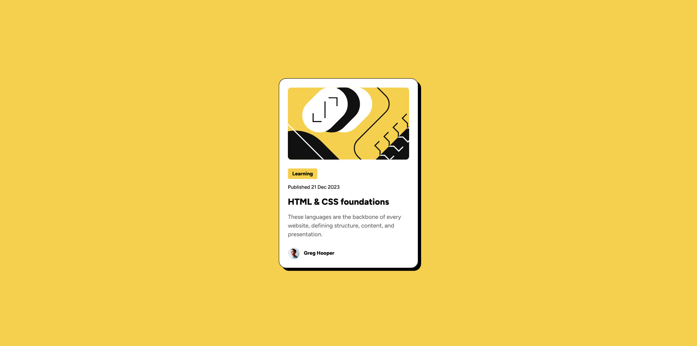

# Frontend Mentor - Blog preview card solution
This is a solution to the [Blog preview card challenge on Frontend Mentor](https://www.frontendmentor.io/challenges/blog-preview-card-ckPaj01IcS). Frontend Mentor challenges help you improve your coding skills by building realistic projects. 

## Table of contents
- [Overview](#overview)
  - [Screenshot](#screenshot)
  - [Links](#links)
- [My process](#my-process)
  - [Built with](#built-with)
  - [What I learned](#what-i-learned)
- [Author](#author)

## Overview

### The challenge
Users should be able to:

- See hover and focus states for all interactive elements on the page
- View the page without any problems on screen sizes ranging from 320px and up

### Screenshot

### Links
- Solution URL: [https://www.frontendmentor.io/solutions/responsive-blog-preview-card-using-flexbox-and-clamp-functions-7TRBSMbhJH](https://www.frontendmentor.io/solutions/responsive-blog-preview-card-using-flexbox-and-clamp-functions-7TRBSMbhJH)
- Live Site URL: [https://alexander3717.github.io/BlogPreviewCardChallenge/](https://alexander3717.github.io/BlogPreviewCardChallenge/)

## My process

### Built with
- Semantic HTML5 markup
- CSS custom properties
- Flexbox
- clamp() functions

### What I learned
A good way to make text size responsive is by using the `clamp()` function.  
It has following syntax: 
`clamp(min font size, preferred font size, max font size)`

You can use a calculator like [utopia.fyi](https://utopia.fyi/) to help you find good values for the parameters.

## Author
Frontend Mentor - [@Alexander3717](https://www.frontendmentor.io/profile/Alexander3717)